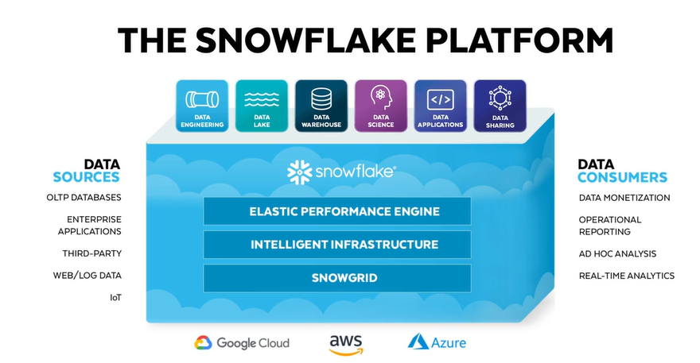

# Compete Hack Hour - Snowflake

## Introduction
Snowflake is a cloud-native SaaS data platform that provides data warehousing, data lake and data science solutions. It runs on AWS, GCP or Azure. 
In this hands-on lab, we will introduce how to get started with Snowflake. You will learn how to load data, query data, work with semi-structured data and visualize data on Snowflake.

## Prerequisites
- An active Azure subscription and storage account
- Register for Snowflake free trial
- Download the dataset in "dataset" folder
- Upload the dataset into Azure blob storage

## About the Dataset
Maternal Health Risk Dataset (Kaggle) contains health data collected from 1014 women. Features include age, systolic blood pressure, diastolic blood pressure, blood glucose, heartrate, and risk level labeled by domain experts. Please find the dataset in the dataset folder.

## Learning Modules
1. Load Data
2. Query Data
3. Create and Join Semi-structured Data
4. Visualize Data
5. Reset your Snowflake Environment
