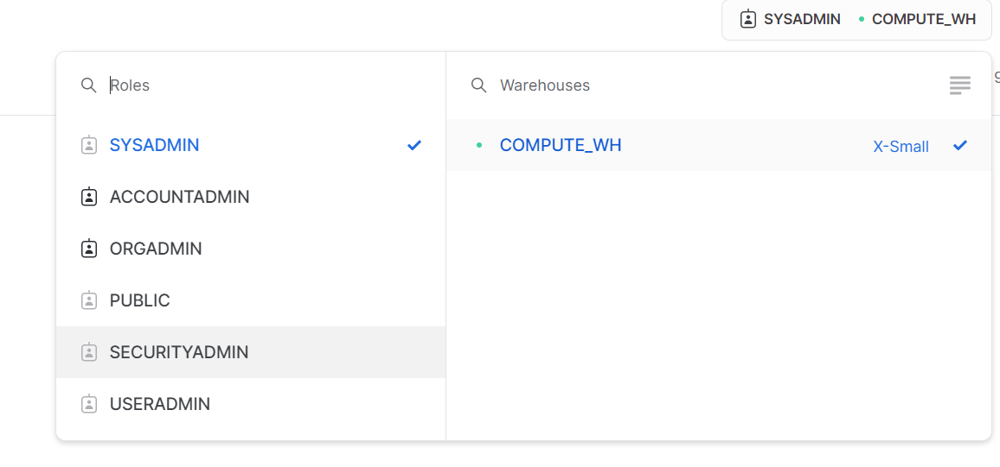
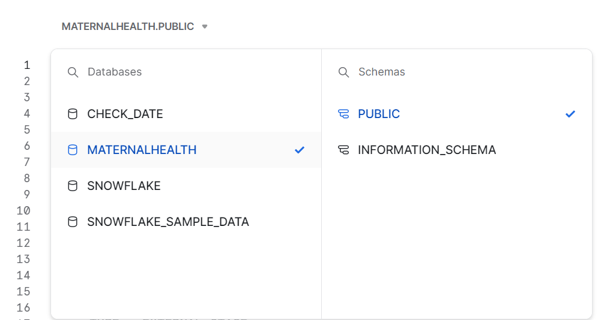
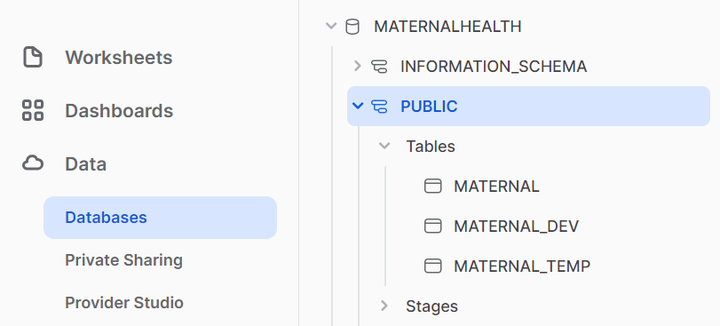
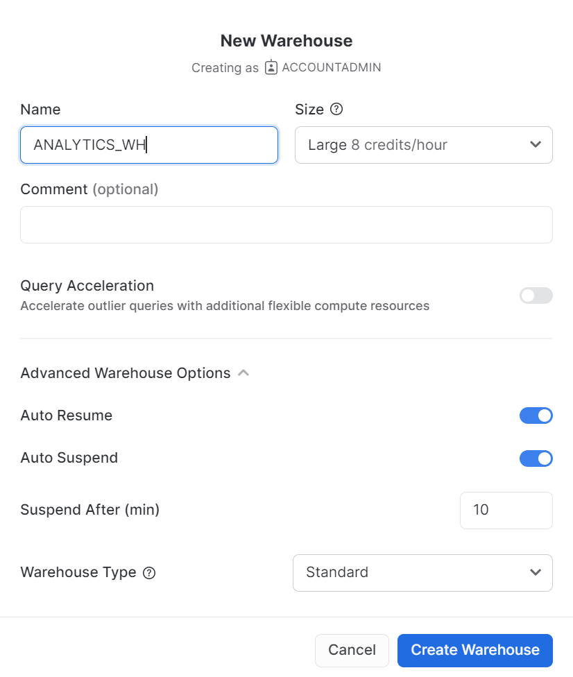

# Load data 
In this module, we will go through how to load data from Azure blob storage to Snowflake.

## Create a database and a table
First, let's create a database called ```MATERNALHEALTH``` to use for loading the structured data.

Ensure you are using the sysadmin role by selecting Switch Role > SYSADMIN.

Navigate to the Databases tab. Click Create, name the database ```MATERNALHEALTH```, then click CREATE.


Select the following context settings:

Role: ```SYSADMIN``` Warehouse: ```COMPUTE_WH```



Next, in the drop-down for the database, select the following context settings:

Database: ```CITIBIKE``` Schema = ```PUBLIC```



To make working in the worksheet easier, let's rename it. In the top left corner, click the worksheet name, which is the timestamp when the worksheet was created, and change it to ```MATERNAL_ZERO_TO_SNOWFLAKE```.

Next we create a table called ```MATERNAL``` to use for loading the comma-delimited data. Instead of using the UI, we use the worksheet to run the DDL that creates the table. Copy the following SQL text into your worksheet:

```
-- create a table
create table maternal(
    Age varchar(50),
    SystolicBP varchar(50),
    DiastolicBP varchar(50),
    BS varchar(50),
    BodyTemp varchar(50),
    HeartRate varchar(50),
    RiskLevel varchar(200)
);
```

Navigate to the Databases tab by clicking the HOME icon in the upper left corner of the worksheet. Then click Data > Databases. In the list of databases, click ```MATERNALHEALTH``` > ```PUBLIC``` > TABLES to see your newly created ```MATERNAL``` table. If you don't see any databases on the left, expand your browser because they may be hidden.



## Create an external stage
We are working with structured, comma-delimited data that has already been staged in an Azure blob storage. Before we can use this data, we first need to create a Stage that specifies the location of our external bucket.

We will use the worksheet to create the external stage. You can also follow the steps listed in the references and use UI to create. Copy the following SQL text into your worksheet:
```
CREATE OR REPLACE STAGE my_azure_stage
  URL='azure://maternal.blob.core.windows.net/maternaldb/'
  CREDENTIALS=(AZURE_SAS_TOKEN='?sv=2021-12-02&ss=bfqt&srt=co&sp=rwdlacupiytfx&se=2023-03-24T16:05:41Z&st=2023-03-15T08:05:41Z&spr=https&sig=CaQjjx3bXbg9dNpDmPLRI97pesG607WwZAl2vW%2BaP5Q%3D');
```

Now let's take a look at the contents of the external stage. Execute the following SQL statement:
```
list @my_azure_stage;
```

## Create a file format
Before we can load the data into Snowflake, we have to create a file format that matches the data structure.

In the worksheet, run the following command to create the file format:
```
create or replace file format csv type='csv'
  compression = 'auto' field_delimiter = ',' record_delimiter = '\n'
  skip_header = 0 field_optionally_enclosed_by = '\042' trim_space = false
  error_on_column_count_mismatch = false escape = 'none' escape_unenclosed_field = '\134'
  date_format = 'auto' timestamp_format = 'auto' null_if = ('') comment = 'file format for ingesting data for zero to snowflake';
```

Verify that the file format has been created with the correct settings by executing the following command:
```
show file formats in database maternalhealth;
```

## Load data
Execute the following statements in the worksheet to load the staged data into the table.
```
copy into maternal from @my_azure_stage file_format=csv PATTERN = '.*csv.*' ;
```

## Create a new warehouse for data analysis
Snowflake can easily do this by assigning different, appropriately-sized warehouses to various workloads. We have used the free-trail default warehouse ```COMPUTE_WH``` for data loading. We will create a new warehouse for data analysis in next module.

Navigate to the Admin > Warehouses tab, click + Warehouse, and name the new warehouse ```ANALYTICS_WH``` and set the size to Large.


## References
https://quickstarts.snowflake.com/guide/getting_started_with_snowflake/index.html#3
https://quickstarts.snowflake.com/guide/getting_started_with_snowflake/index.html#4
