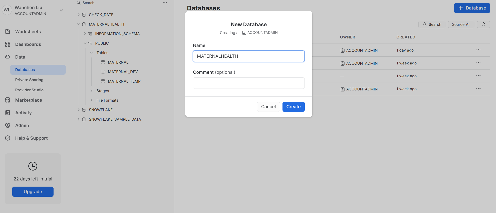

# Load data 
In this module, we will go through how to load data from Azure blob storage to Snowflake.

## Create a database and a table
First, let's create a database called ```MATERNALHEALTH``` to use for loading the structured data.
Ensure you are using the sysadmin role by selecting Switch Role > SYSADMIN.
Navigate to the Databases tab. Click Create, name the database ```MATERNAL```, then click CREATE.

