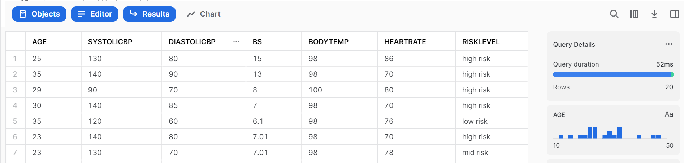
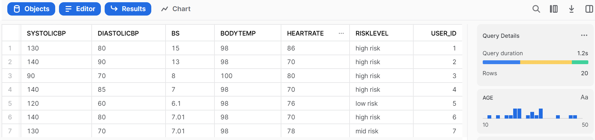

# Query data
In this module, we will use sql queries to explore and modify the dataset.

## Delete the column-name row
When you run ```select * from maternal```, you would find that the first row is the column name of the dataset. That's the row we want to delete. Run following query to delete it:
```
delete from maternal where age = 'Age';
```
Run the query:
```
select * from maternal limit 20;
```
You should see


## Give an id column
In this dataset, each row does not have a specific id. To make tracking the record easier, we want to add a column to give each record an id. We cannot directly modify the copied resource table. In this case, we need to create another table:
```
CREATE TABLE maternal_temp LIKE maternal;
ALTER TABLE maternal_temp ADD Column User_id int IDENTITY(1,1);
```
Run the query:
```
select * from maternal_temp limit 20;
```
You should see


## Count number of maternal women in an age range
You can also try the following queries to see how many maternal women are between 18 and 35 years old:
```
select count(*) from maternal where age >= '18' and age <= '35';
```
