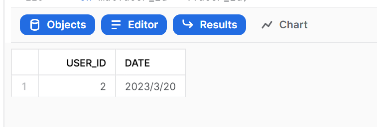
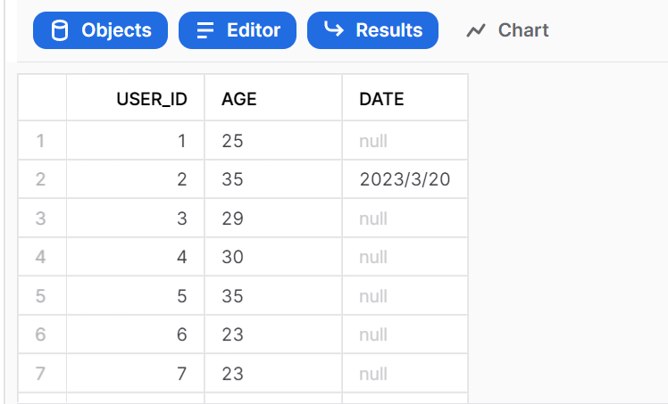

# Work with Semi-Structured Data
In this module, we will create a date database containing the user_id and date in json format. We will also join this table with the maternal table to indicate the date that the record is created.

## Create a new database and table for the data
First, in the worksheet, let's create a database named ```CHECK_DATE``` to use for storing the semi-structured JSON data.
```
create database check_date;
```

Execute the following USE commands to set the worksheet context appropriately:
```
use role accountadmin;
use warehouse compute_wh;
use database check_date;
use schema public;
```

Next, let's create a table to store the JSON data. In the worksheet, execute the following CREATE TABLE command:
```
create table json_date_data (v variant);
```

Now, we want to put some data into the table. We will create some "fake" data here. Run the following command to input JSON data:
```
insert into json_date_data
select
parse_json(
'{
      "user_id":"2",
      "date":"2023/3/20",
}');
```

## Create a View and Query Semi-Structured Data
Run the following command to create a columnar view of the semi-structured JSON data so it is easier for analysts to understand and query. 
```
create or replace view json_date_data_view as
select
    v:user_id::int as user_id,
    v:date::string as date
from json_date_data;

select * from json_date_data_view;
```


## Join with maternal dataset
We will now join the JSON date data to our MATERNALHEALTH.PUBLIC.MATERNAL data to track the date that the user made the record.
```
select 
mat.user_id,
mat.age,
v.date
from maternalhealth.public.maternal_temp as mat
left outer join json_date_data_view as v
on mat.user_id = v.user_id;
```

